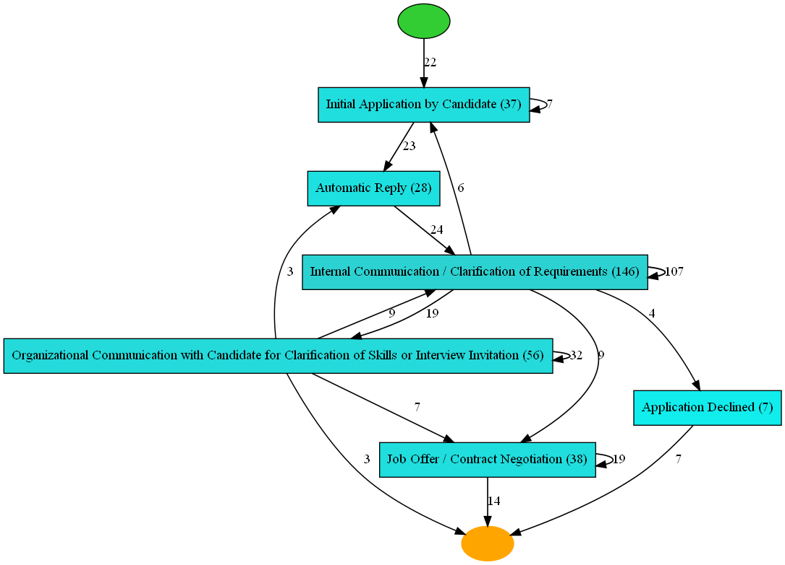
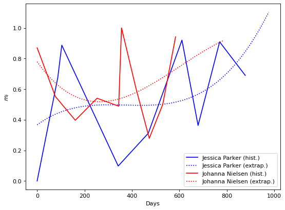

# Procedural Model for Optimizing Human Learning in Business Processes Based on Unstructured Data

This repository contains the code of the implementation of the procedural model proposed in the master thesis
> Procedural Model for Optimizing Human Learning in Business Processes Based on Unstructured Data

## Structure
The repository is structured as follows:

**Jupyter Notebooks**
- `main.ipynb`: contains the main pipeline
- `parameter_study.ipynb`: contains the code of the parameter study conducted in 6.4.2 of the thesis
- `out/param_study/plot.ipynb`: Notebook to plot the results of the parameter study

**Other Files**
- `stages` directory: contains program logic and helper classes/methods for the process mining and text mining components
- `resources`: contains the input sample dataset
- `out`: contains the results of the parameter study as well as the created event logs
- `getAbstract.py`: helper tool to automatically retrieve incomplete abstracts (for records obtained from Google Scholar)

## Description of Pipeline and Results
The pipeline uses unsupervised learning (LDA) to assign messages of an HR process to predefined topics and then applies process mining techniques in order to obtain underlying process models. Finally, a learning metric is developed to assess the involved human actor's performance throughout the process executions and a third order polynomial is used to extrapolate the learning performance and -rate of the learners.

* Correctly identified messages: 85%
* Maximum metrics for obtained process model (f/p/g/s): 0.908/0.984/0.569/0.684

### Obtained Process Model (Heuristic Net)

### Obtained Learning Metrics

## Disclaimer
The dataset which was used in this work was artificially created. All the examples are purely fictitious and any resemblance to existing persons, companies, organizations, email addresses, URLs or any other entities is purely coincidental. The dataset does not reflect real communication and the contents in the dataset are fictitious.